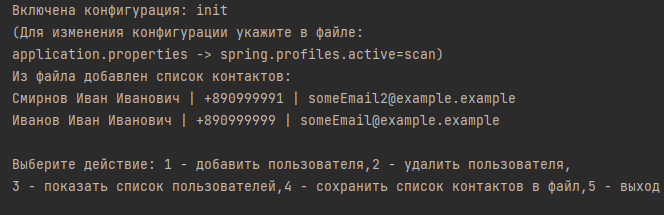

 

  
<h1 align="center">КОНТАКТЫ</h1>

## Содержание:

* [О приложении](#О-приложении)
* [Приступая к работе](#приступая-к-работе)
* [Использование](#Использование)
* [Автор](#Автор)

<h2 align="left">Разработка с использованием:</h2>

######

  
  
  
  
  

## О приложении

Данное консольное приложение дает возможность создать, просмотреть, удалить и сохранить данные о контактах через консольный ввод.

Вы можете:
* Добавить данные котакта в указанном формате
* Удалить котакт указав email
* Сохранить имеющийся список котактов в текстовый файл
* Используя переключение между профилями, инициализировать хранилище с контактами через файл, если профиль приложения = init.

Пример консольного вывода приложения:

### Приступая к работе

Скачайте архив с приложением, распакуйте его в папку.

Запуск приложения осуществляется в среде разработки.
Запустите метод Main.main() командой Run.
Затем в консоли вводите команды, для работы с приложением.

###Использование

После запуска,приложение выведет инструкцию с перечнем команд в консоль:
* 1 - добавить пользователя
* 2 - удалить пользователя
* 3 - показать список пользователей
* 4 - сохранить список контактов в файл
* 5 - выход

Вы должны, перейдя на следующую строку, после инструкции, указать цифру выбранной команды и нажать "enter"

Включить или отключить инициализацию контактов через загрузку из файла contacts.txt можно через профили. 

Для этого укажите в файле:
**application.yaml** другое значение для параметра:

**spring.profiles.active: scan** (отключена инициализация контактов из файла)

**spring.profiles.active: init** (включить инициализацию контактов из файла)

### Автор

* **Устименко Дарья** - *Студент курсов Skillbox* - [DaryaUstimenko](https://github.com/DaryaUstimenko?tab=repositories) 
