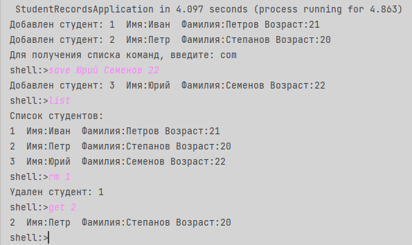

 

  <a href="https://github.com/ShaanCoding/ReadME-Generator">

[//]: # (    )
  </a>
<h1 align="center">УЧЕТ СТУДЕНТОВ</h1>

### Содержание:

* [О приложении](#О-приложении)
* [Приступая к работе](#приступая-к-работе)
* [Использование](#Использование)
* [Автор](#Автор)

<h2 align="left">Разработка с использованием:</h2>

######

  
  
  
  
  

## О приложении

Данное консольное приложение дает возможность создать, просмотреть и удалить данные о студентах через консольный ввод.

Интерфейс консольного приложения реализован с помощью стартера Spring Shell.

Через консоль есть возможность:
* Добавить студента
* Просмотреть данные одного студента по ID
* Просмотреть список всех студентов
* Удалить студента по ID
* Удалить всех студентов

При старте приложения загружается готовый список студентов, переданный через создание событий.

Пример консольного вывода приложения:

### Приступая к работе
Приложение можно запустить двумя способами:
1. Скачайте архив с приложением, распакуйте его в папку.
   Запуск приложения осуществляется в среде разработки.
   
   Запустите метод Main.main() командой Run.
   
   Затем в консоли вводите команды, для работы с приложением.
3. Запуск можно осуществить через Docker.

   Для этого запустите в командной строке поочередно команды:

  
    cd [путь к проекту]
    ./gradlew clean bootJar
    docker build -t students .
    docker run -i students

Затем в консоли вводите команды, для работы с приложением.
###Использование

После запуска,приложение выведет в консоль список добавленных студентов при старте приложения и рекомендацию, как получить инструкцию с перечнем команд:

######Введите одну из команд:
  * _save Имя Фамилию возраст_ - для добавления студента: 
  * _get id_ - для просмотра одного студента 
  * _list_ - для просмотра всех студентов
  * _rm id_ - для удаления одного студента
  * _rm all_ - для удаления всех студентов 
  
### Автор
* **Устименко Дарья** - *Студент курсов Skillbox* - [DaryaUstimenko](https://github.com/DaryaUstimenko/projects) 
